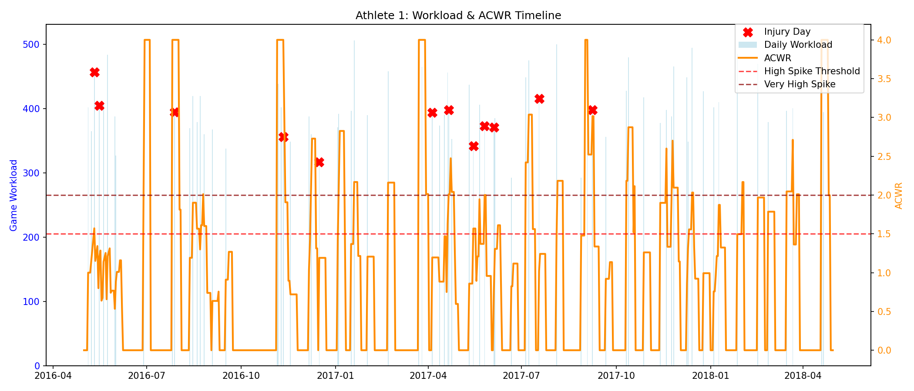
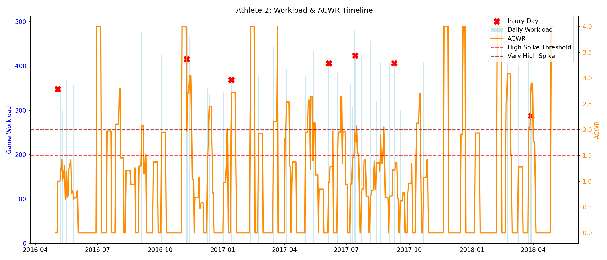
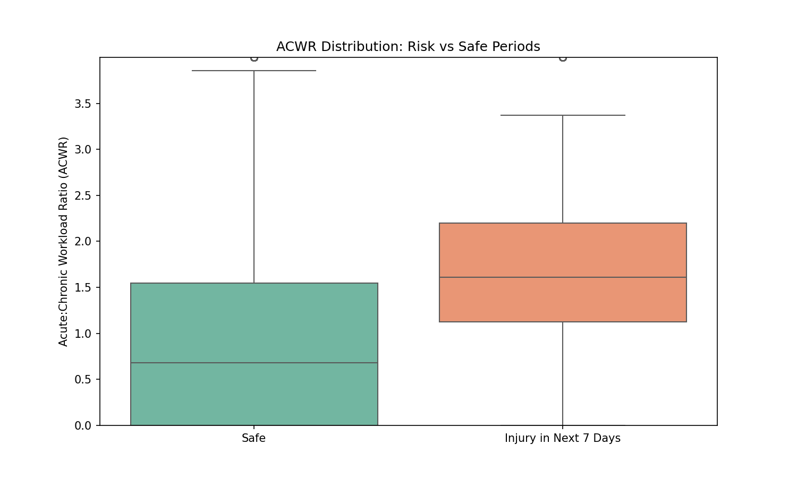

# Athlete Injury Workload Prediction AI Co-Pilot

## Overview
This project develops a modular AI system to predict sports injury risk using workload monitoring (ACWR), session-level physiological/biomechanical signals, and athlete baseline profiles.

## Datasets
- **Longitudinal Workload** (`mergedData.csv`): Daily game_workload, hip_mobility/groin_squeeze, injury flags for ~30 athletes over 2016–2018.
- **Multimodal Sessions** (`sports_multimodal_data.csv`): Per-session sensor data with injury_risk labels.
- **Athlete Profiles** (`collegiate_athlete_injury_dataset.csv`): ~200 athletes with demographics, training intensity, ACL risk scores.

## Key Results (Workload Component)
Processed data shows higher ACWR in the 7 days preceding injuries (mean 1.74 vs 0.91 on safe days).

### Visualizations

(Images may need relative paths adjusted if viewing on GitHub.)