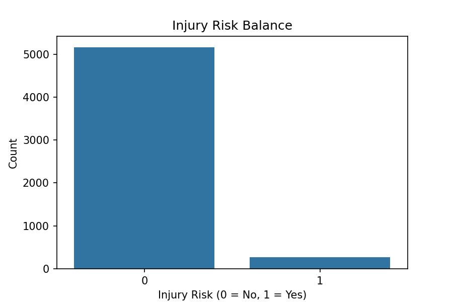
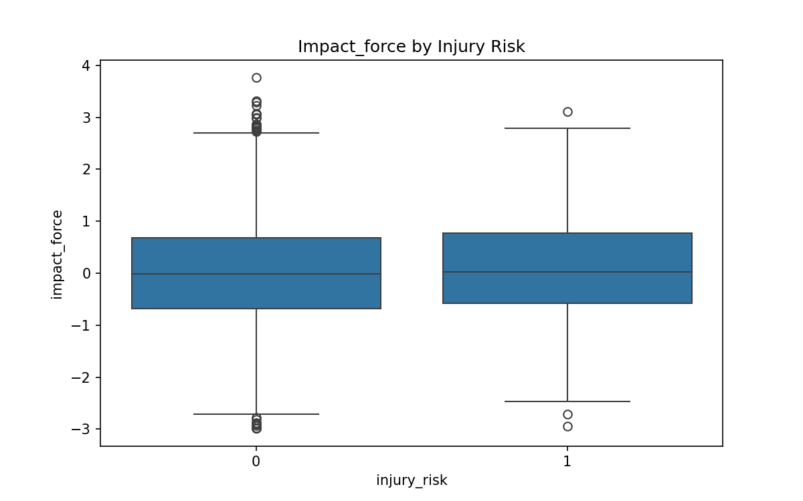
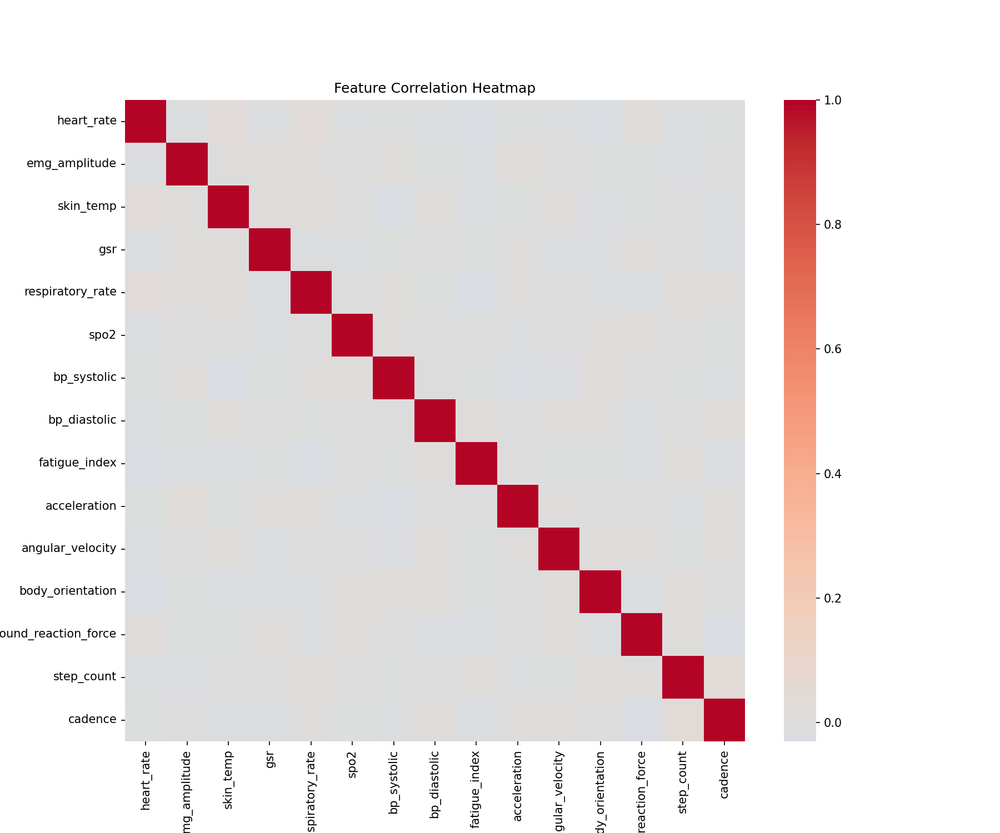
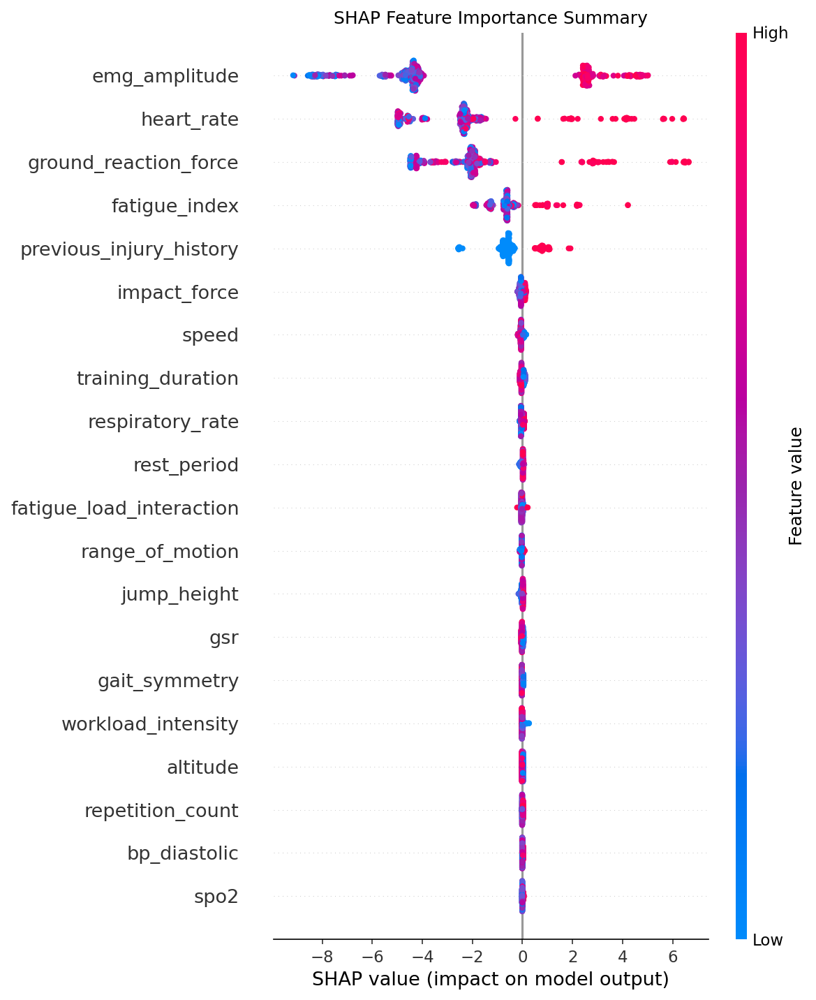

## Session-Level Multimodal Risk Prediction

**Objective**  
Predict immediate injury risk for a single training session using physiological, biomechanical, and contextual sensor data.

### Data & Features
- **Source**: `sports_multimodal_data.csv` (5,430 anonymous sessions)  
- **Target**: `injury_risk` (binary, ~5% positive)  
- **Features** (31 original + 2 engineered):  
  - Physiological: heart_rate, emg_amplitude, fatigue_index, etc.  
  - Biomechanical: impact_force, ground_reaction_force, speed, acc_rms, etc.  
  - Context: training_duration, previous_injury_history, workload_intensity, rest_period  
  - Engineered: impact_per_speed, fatigue_load_interaction  
- Processing: z-score standardization, clipping negative impact_force, no missing values.

**Insight**: Strong separation between risk and safe sessions in key stress indicators.

### Visualizations
Risk balance, feature boxplots by risk level, correlation heatmap.

  
  

### XGBoost Predictive Model
**Setup**: Stratified 80/20 split, imbalance-weighted, depth 5, 150 estimators.

**Performance** (test set):

| Metric                        | Value     | Interpretation                              |
|-------------------------------|-----------|---------------------------------------------|
| ROC-AUC                       | **1.0000** | Near-perfect discrimination                 |
| Recall @ 0.5 (positives)      | **1.00**  | Detects 100% of high-risk sessions          |
| Precision @ 0.5 (positives)   | **0.98**  | Very few false positives                    |
| F1-score @ 0.5 (positives)    | **0.99**  | Outstanding balance                         |

**Top SHAP Features** (global importance)

1. emg_amplitude (muscle activation)  
2. heart_rate  
3. ground_reaction_force  
4. fatigue_index  
5. previous_injury_history  

**Interpretation**  
EMG amplitude, heart rate, and ground reaction force dominate risk prediction — direct markers of neuromuscular and impact stress. The near-perfect performance indicates strong signals in this dataset, making it ideal for real-time session alerts.

**Potential Real-World Impact**  
Enables a "today's session risk score" — e.g., flag high-risk drills and suggest adjustments. Reducing acute injuries (strains, sprains, impacts) could avoid significant medical and performance costs (ASPE fracture charges $3,400–$7,600; many injuries also cause lost training days).

**Limitations & Future Work**  
- Near-perfect metrics suggest synthetic/highly separable data — expect lower real-world performance.  
- No athlete IDs → no personalization.  
- Future: dependence plots, integration with workload history, real athlete validation.

This component forms the micro (per-session) layer of the injury-risk co-pilot.