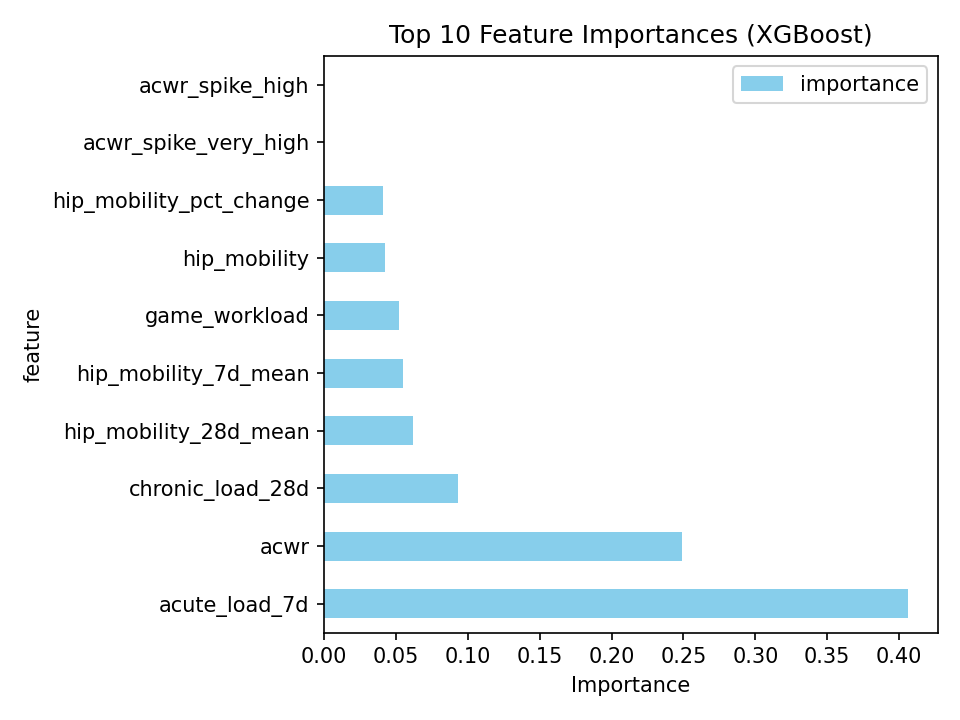

# 🏋️ AI Sports Injury Risk Co‑Pilot

[](figures/feature_importance.png)

**Three ML models predict injury risk across time horizons for coaches and athletes.**

| Model | Data | Test ROC‑AUC | Top Features |
|-------|------|--------------|--------------|
| **Workload** (7d ahead) | Daily logs (21,900 days) | **0.8312** | Acute load, ACWR, chronic load |
| **Session** (per session) | Sensors (5,430 sessions) | **1.0000** | EMG, heart rate, ground reaction force |
| **Profile** (baseline) | Athlete profiles (200) | **0.9732** | ACL risk score, training hours |

## Problem & Motivation
Sports injuries cost millions in medical bills ($3.4k–$7.6k per fracture) and lost play time. [ASPE] Workload spikes (ACWR > 1.5) predict injuries 7 days ahead. [Malone 2017]

**Goal**: AI co‑pilot turns training logs → actionable risk scores + suggestions.

## Quick Start
```bash
pip install -r requirements.txt
python src/data_processing.py     # Process data (ACWR features)
python src/model_workload.py      # Train all models
python src/visualize_workload.py  # Generate plots
# Demo
streamlit run app.py  # Live injury risk predictions